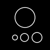

<!-- PROJECT SHIELDS -->
<!--
[![Contributors][contributors-shield]][contributors-url]
[![Forks][forks-shield]][forks-url]
[![Stargazers][stars-shield]][stars-url]
[![Issues][issues-shield]][issues-url]
[![MIT License][license-shield]][license-url]
[![LinkedIn][linkedin-shield]][linkedin-url]-->
[![MIT License][license-shield]][license-url]

<!-- PROJECT LOGO -->
<br />
<p align="center">
  <a href="">
    
  </a>

  <h3 align="center">Planet System Generator</h3>

  <p align="center">
    Generate your own minimalist planetary system
    <br />
    <!--<a href="https://github.com/github_username/repo"><strong>Explore the docs »</strong></a>
    <br />
    <br />
    <a href="https://github.com/github_username/repo">View Demo</a>
    · -->
    <a href="https://github.com/github_username/repo/issues">Report Bug</a>
    ·
    <a href="https://github.com/github_username/repo/issues">Request Feature</a>
  </p>
</p>


<!-- TABLE OF CONTENTS -->
## Table of Contents

* [About the Project](#about-the-project)
  * [Built With](#built-with)
* [Getting Started](#getting-started)
  * [Installation](#installation)
* [Usage](#usage)
* [Roadmap](#roadmap)
* [Contributing](#contributing)
* [License](#license)
* [Contact](#contact)
* [Acknowledgements](#acknowledgements)


<!-- ABOUT THE PROJECT -->
## About The Project

![Screenshot][product-screenshot]

Planet System Generator is a program that generates small, minimal planetary systems. This project is inspired by the work of [erdavids](https://github.com/erdavids) with his work [Space Creator](https://github.com/erdavids/Space-Creator).

Most of the variables used to generate the SVG file can be overload (more information in the [Usage](#usage) section).


### Built With

* [Python 3]()


<!-- GETTING STARTED -->
## Getting Started

To get a local copy up and running follow these simple steps.


### Installation

1. Clone the repo
```sh
git clone https://gitlab.com/gauthier.chaty/planet-system-generator.git
```
2. Install PIP packages
```sh
pip install -r requirements.txt
```


<!-- USAGE EXAMPLES -->
## Usage

To generate a planetary system :

```shell
>> python planet_system.py
Generating planetary system "zfeiu2jlhc7aixwnc4vb8tdid"
SVG file saved : solar_system.svg
```

To generate a system with a known seed

```shell
>> python planet_system.py --id zfeiu2jlhc7aixwnc4vb8tdid
Generating planetary system "zfeiu2jlhc7aixwnc4vb8tdid"
SVG file saved : solar_system.svg
```

To change the size of the output SVG file :
```shell
>> python planet_system.py --width 3000 --height 1500
Generating planetary system "4xitginbeugebs1kenupnj7ah"
SVG file saved : solar_system.svg
```

If you don't want to change the variable one by one you can update the default configuration file `config.ini`

Below the list of all variables you can change :

```shell
>> python planet_system.py --help
usage: planet_system.py [-h] [--width WIDTH] [--height HEIGHT]
                        [--color_palette COLOR_PALETTE]
                        [--font_size FONT_SIZE] [--nb_stars NB_STARS]
                        [--min_size_stars MIN_SIZE_STARS]
                        [--max_size_stars MAX_SIZE_STARS]
                        [--color_proba COLOR_PROBA] [--nb_planets NB_PLANETS]
                        [--distance_planet DISTANCE_PLANET]
                        [--min_size_planet MIN_SIZE_PLANET]
                        [--max_size_planet MAX_SIZE_PLANET]
                        [--ring_proba RING_PROBA] [--min_ring MIN_RING]
                        [--max_ring MAX_RING] [--moon_proba MOON_PROBA]
                        [--distance_moon DISTANCE_MOON]
                        [--min_nb_moons MIN_NB_MOONS]
                        [--max_nb_moons MAX_NB_MOONS]
                        [--min_size_moon MIN_SIZE_MOON]
                        [--max_size_moon MAX_SIZE_MOON] [--id ID]
                        [-f FILENAME] [-v]

Args that start with '--' (eg. --width) can also be set in a config file
(config.ini). Config file syntax allows: key=value, flag=true, stuff=[a,b,c]
(for details, see syntax at https://goo.gl/R74nmi). If an arg is specified in
more than one place, then commandline values override config file values which
override defaults.

optional arguments:
  -h, --help            show this help message and exit
  --width WIDTH         SVG width
  --height HEIGHT       SVG height
  --color_palette COLOR_PALETTE
                        list of colors for stars
  --font_size FONT_SIZE
                        font size for planet name
  --nb_stars NB_STARS   number of stars
  --min_size_stars MIN_SIZE_STARS
                        minimal star size
  --max_size_stars MAX_SIZE_STARS
                        maximal star size
  --color_proba COLOR_PROBA
                        probability of coloured star
  --nb_planets NB_PLANETS
                        number of planets
  --distance_planet DISTANCE_PLANET
                        distance in pixel between each planet
  --min_size_planet MIN_SIZE_PLANET
                        minimal planet size
  --max_size_planet MAX_SIZE_PLANET
                        maximal planet size
  --ring_proba RING_PROBA
                        probability of a ringed planet
  --min_ring MIN_RING   minimal number of rings
  --max_ring MAX_RING   maximal number of rings
  --moon_proba MOON_PROBA
                        probability for a planet to have moons
  --distance_moon DISTANCE_MOON
                        distance between each moon
  --min_nb_moons MIN_NB_MOONS
                        minimal number of moon
  --max_nb_moons MAX_NB_MOONS
                        maximal number of moon
  --min_size_moon MIN_SIZE_MOON
                        minimal size of moon
  --max_size_moon MAX_SIZE_MOON
                        maximal size of moon
  --id ID               random seed for generation
  -f FILENAME, --filename FILENAME
                        file name to save
  -v, --version         show program's version number and exit
```


<!-- ROADMAP _For more examples, please refer to the [Documentation](https://example.com)_-->

<!-- ROADMAP -->
## Roadmap

See the [open issues](https://github.com/github_username/repo/issues) for a list of proposed features (and known issues).


<!-- CONTRIBUTING -->
## Contributing

Contributions are what make the open source community such an amazing place to be learn, inspire, and create. Any contributions you make are **greatly appreciated**.

1. Fork the Project
2. Create your Feature Branch (`git checkout -b feature/AmazingFeature`)
3. Commit your Changes (`git commit -m 'Add some AmazingFeature'`)
4. Push to the Branch (`git push origin feature/AmazingFeature`)
5. Open a Pull Request


<!-- LICENSE -->
## License

Distributed under the MIT License. See `LICENSE` for more information.


<!-- CONTACT -->
## Contact

Gauthier Chaty - [@gokender](https://twitter.com/gokender) <!-- - gauthier.chaty@outlook.com -->

Project Link: [Planet system generator](https://gitlab.com/gauthier.chaty/planet-system-generator.git)


<!-- ACKNOWLEDGEMENTS -->
## Acknowledgements

* [erdavids](https://github.com/erdavids) for the inspiration
* [Frostpizza](https://github.com/frostifru) for the advices


<!-- MARKDOWN LINKS & IMAGES -->
<!-- https://www.markdownguide.org/basic-syntax/#reference-style-links -->
[contributors-shield]: https://img.shields.io/github/contributors/othneildrew/Best-README-Template.svg?style=flat-square
[contributors-url]: https://github.com/othneildrew/Best-README-Template/graphs/contributors
[forks-shield]: https://img.shields.io/github/forks/othneildrew/Best-README-Template.svg?style=flat-square
[forks-url]: https://github.com/othneildrew/Best-README-Template/network/members
[stars-shield]: https://img.shields.io/github/stars/othneildrew/Best-README-Template.svg?style=flat-square
[stars-url]: https://github.com/othneildrew/Best-README-Template/stargazers
[issues-shield]: https://img.shields.io/github/issues/othneildrew/Best-README-Template.svg?style=flat-square
[issues-url]: https://github.com/othneildrew/Best-README-Template/issues
[license-shield]: https://img.shields.io/github/license/othneildrew/Best-README-Template.svg?style=flat-square
[license-url]: LICENSE.txt
[product-screenshot]: /data/images/screenshot.png